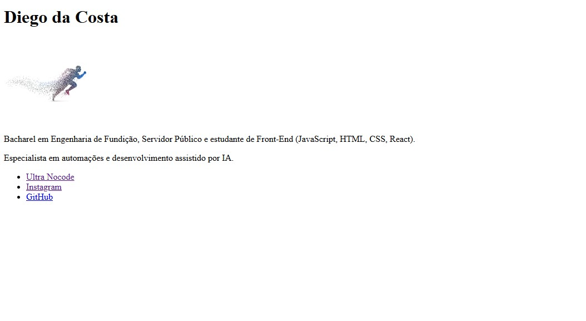

# 🙋 Desafio #1 — Página "Sobre Mim"

Primeira página HTML da trilha de estudos Front-End.
Uma apresentação pessoal simples, sem CSS — foco total em estrutura semântica.

---

## 📸 Preview

---

## 🛠️ Tecnologias

---

## 📋 O que foi praticado

- Estrutura base de um documento HTML (`DOCTYPE`, `html`, `head`, `body`)
- Meta tags essenciais (`charset`, `viewport`)
- Hierarquia de títulos (`h1`)
- Imagem com caminho relativo e atributo `alt` (acessibilidade)
- Parágrafo de texto (`p`)
- Links externos com `target="_blank"` e `rel="noopener noreferrer"` (segurança)
- Lista semântica de links (`ul` / `li`)

---

## ✅ Requisitos cumpridos

- [x] `DOCTYPE`, `html`, `head`, `body` completos
- [x] Título da aba (`title`)
- [x] `h1` com nome
- [x] Foto com `alt` descritivo
- [x] Parágrafo de apresentação
- [x] 3 links externos com `target="_blank"`

---

## 🚀 Como visualizar

**Online:** [Abrir página ao vivo](https://ultranocode.github.io/desafios-frontend/html-css/01-sobre-mim/)

**Localmente:** clone o repositório e abra `html-css/01-sobre-mim/index.html` no navegador.

---

## 📚 Parte da trilha

Este é o **Desafio #1 de 15** da trilha de estudos HTML & CSS.

| # | Desafio | Status |
|---|---------|--------|
| 01 | Página "Sobre Mim" | ✅ Concluído |
| 02 | Receitas Favoritas | ✅ Concluído |
| 03 | Blog de Filmes | 🔄 Em andamento |
| 04 | Formulário de Contato | ⏳ Pendente |
| 05 | Pesquisa de Satisfação | ⏳ Pendente |
| 06 | Página de Produto com Mídia | ⏳ Pendente |
| 07 | Estilizar "Sobre Mim" | ⏳ Pendente |
| 08 | Botões Interativos | ⏳ Pendente |
| 09 | Card de Perfil | ⏳ Pendente |
| 10 | Navbar com Flexbox | ⏳ Pendente |
| 11 | Galeria com Grid | ⏳ Pendente |
| 12 | Página Responsiva | ⏳ Pendente |
| 13 | Portfólio Pessoal | ⏳ Pendente |
| 14 | Landing Page | ⏳ Pendente |
| 15 | Cardápio de Cafeteria | ⏳ Pendente |

---

## 👨‍💻 Autor

**Diego da Costa**

