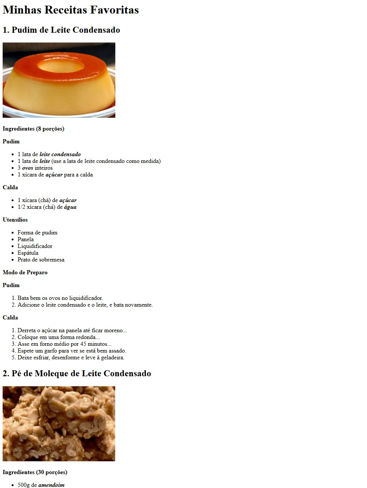

# 🍽️ Desafio #2 — Receitas Favoritas

Página HTML com três receitas favoritas.
Foco em listas semânticas, hierarquia de títulos e estrutura com `<article>`.

---

## 📸 Preview

---

## 🛠️ Tecnologias

---

## 📋 O que foi praticado

- Agrupamento de conteúdo independente com `<article>`
- Listas não ordenadas `<ul>` para ingredientes
- Listas ordenadas `<ol>` para modo de preparo
- Separação de etapas com `
` fora das listas
- Ênfase com `<strong>` e `<em>`
- Imagens com caminho relativo e atributo `alt`
- Comentários HTML para organizar o código

---

## ✅ Requisitos cumpridos

- [x] 3 receitas em `<article>` independentes
- [x] Título `<h2>` por receita
- [x] Imagem por receita com `alt`
- [x] Ingredientes em `<ul>`
- [x] Modo de preparo em `<ol>`
- [x] Estrutura válida — sem `
` dentro de `<ul>` ou `<ol>`

---

## 🍮 Receitas incluídas

1. Pudim de Leite Condensado
2. Pé de Moleque de Leite Condensado
3. Macarrão da Panela de Pressão

---

## 🚀 Como visualizar

**Online:** [Abrir página ao vivo](https://ultranocode.github.io/desafios-frontend/html-css/02-receitas/)

**Localmente:** clone o repositório e abra `html-css/02-receitas/index.html` no navegador.

---

## 📚 Parte da trilha

Este é o **Desafio #2 de 15** da trilha de estudos HTML & CSS.

| # | Desafio | Status |
|---|---------|--------|
| 01 | Página "Sobre Mim" | ✅ Concluído |
| 02 | Receitas Favoritas | ✅ Concluído |
| 03 | Blog de Filmes | ⏳ Pendente |

---

## 👨‍💻 Autor

**Diego da Costa**

