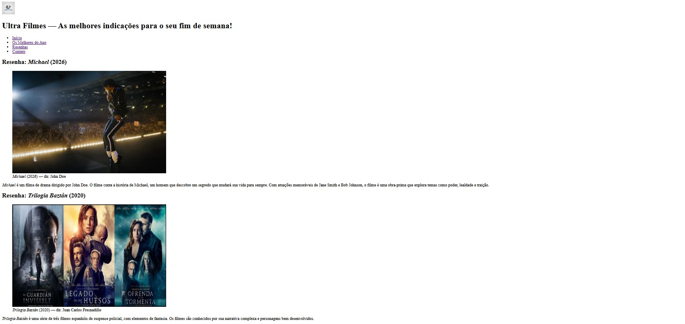

# 🎬 Desafio #3 — Blog de Filmes

Blog de resenhas com estrutura semântica completa.
Foco em tags estruturais (`header`, `nav`, `main`, `aside`, `footer`)
e elementos de referência (`cite`, `time`, `figure`).

---

## 📸 Preview

---

## 🛠️ Tecnologias

---

## 📋 O que foi praticado

- Estrutura semântica completa com `<header>`, `<nav>`, `<main>`, `<aside>` e `<footer>`
- Agrupamento de conteúdo independente com `<article>`
- Navegação com `<nav>` e lista de links
- Conteúdo lateral com `<aside>` dentro do `<main>`
- Imagens com legenda usando `<figure>` e `<figcaption>`
- Títulos de obras com `<cite>`
- Datas semânticas com `<time datetime="">`
- Entidade HTML `&copy;` no rodapé

---

## ✅ Requisitos cumpridos

- [x] `<header>` com logo, título e menu de navegação
- [x] `<nav>` com 4 links
- [x] `<main>` com 3 `<article>` (resenhas)
- [x] `<aside>` com lista de filmes recomendados
- [x] `<footer>` com copyright
- [x] Cada resenha com título, imagem e parágrafo

---

## 🎥 Resenhas incluídas

| Filme | Ano | Diretor |
|-------|-----|---------|
| Michael | 2026 | John Doe |
| Trilogia Baztán | 2020 | Juan Carlos Fresnadillo |
| Nomadland | 2020 | Chloé Zhao |

---

## 🚀 Como visualizar

**Online:** [Abrir página ao vivo](https://ultranocode.github.io/desafios-frontend/html-css/03-blog-filmes/)

**Localmente:** clone o repositório e abra `html-css/03-blog-filmes/index.html` no navegador.

---

## 📚 Parte da trilha

Este é o **Desafio #3 de 15** da trilha de estudos HTML & CSS.

| # | Desafio | Status |
|---|---------|--------|
| 01 | Página "Sobre Mim" | ✅ Concluído |
| 02 | Receitas Favoritas | ✅ Concluído |
| 03 | Blog de Filmes | ✅ Concluído |
| 04 | Formulário de Contato | ⏳ Pendente |
| 05 | Pesquisa de Satisfação | ⏳ Pendente |

---

## 👨‍💻 Autor

**Diego da Costa**

