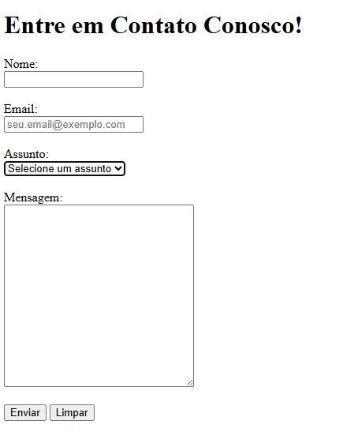

# 📬 Desafio #4 — Formulário de Contato

Página com formulário de contato completo.
Foco em campos de entrada, labels, validação nativa e boas práticas de acessibilidade.

---

## 📸 Preview

---

## 🛠️ Tecnologias

---

## 📋 O que foi praticado

- Estrutura de formulário com `<form>`, `action` e `method`
- Conexão semântica entre `<label for>` e `id` do campo
- Input de texto com `type="text"` e `required`
- Input de email com `type="email"` e `placeholder`
- Menu de seleção com `<select>` e `<option>`
- Área de texto longa com `<textarea>`
- Validação nativa do navegador com `required`
- Botões de envio (`submit`) e limpeza (`reset`)

---

## ✅ Requisitos cumpridos

- [x] `<form>` com `action` e `method="post"`
- [x] Input de nome com `label` conectado
- [x] Input de email com `placeholder` e validação
- [x] `<select>` de assunto com opção vazia como placeholder
- [x] `<textarea>` para mensagem
- [x] Todos os campos com `required`
- [x] Botão de enviar e botão de limpar

---

## 🚀 Como visualizar

**Online:** [Abrir página ao vivo](https://ultranocode.github.io/desafios-frontend/html-css/04-contato/)

**Localmente:** clone o repositório e abra `html-css/04-contato/index.html` no navegador.

---

## 📚 Parte da trilha

Este é o **Desafio #4 de 15** da trilha de estudos HTML & CSS.

| # | Desafio | Status |
|---|---------|--------|
| 01 | Página "Sobre Mim" | ✅ Concluído |
| 02 | Receitas Favoritas | ✅ Concluído |
| 03 | Blog de Filmes | ✅ Concluído |
| 04 | Formulário de Contato | ✅ Concluído |
| 05 | Pesquisa de Satisfação | ⏳ Pendente |
| 06 | Página de Produto com Mídia | ⏳ Pendente |

---

## 👨‍💻 Autor

**Diego da Costa**

