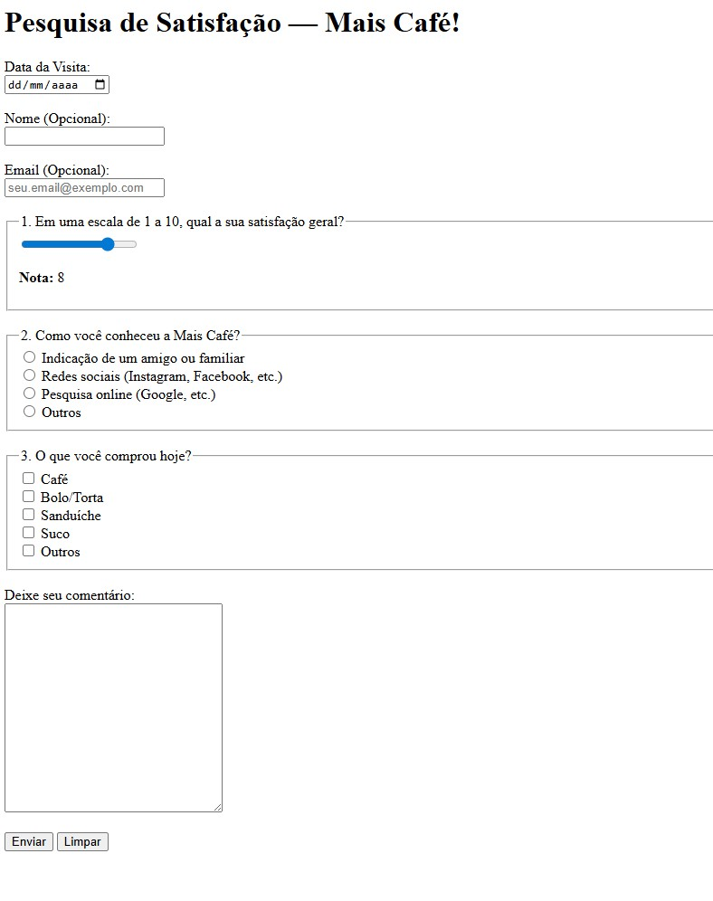

# 📋 Desafio #5 — Pesquisa de Satisfação

Formulário de pesquisa de satisfação para uma cafeteria fictícia.
Foco em tipos variados de input, agrupamento semântico com `<fieldset>`
e exibição dinâmica do valor do slider.

---

## 📸 Preview



---

## 🛠️ Tecnologias


---

## 📋 O que foi praticado

- Agrupamento semântico de campos com `<fieldset>` e `<legend>`
- Input de data com `type="date"`
- Slider de avaliação com `type="range"` e exibição dinâmica via `oninput`
- Radio buttons para escolha única (mesmo `name`)
- Checkboxes para múltipla escolha
- Área de comentários com `<textarea>`
- Campos opcionais (sem `required`) e obrigatórios (com `required`)
- Botões de envio (`submit`) e limpeza (`reset`)

---

## ✅ Requisitos cumpridos

- [x] `type="date"` para data da visita
- [x] `type="range"` com nota exibida em tempo real
- [x] Radio buttons — "Como nos conheceu?" (4 opções)
- [x] Checkboxes — "O que comprou?" (múltipla escolha)
- [x] `<textarea>` para comentários
- [x] Campos opcionais sem `required`
- [x] `<fieldset>` + `<legend>` em todos os grupos
- [x] Botão de enviar e botão de limpar

---

## 💡 Aprendizado extra

O `type="range"` por si só não exibe o valor selecionado.
Para mostrar a nota em tempo real foi necessário JavaScript inline:

```html
<input type="range" oninput="valorNota.innerText = this.value">
<span id="valorNota">8</span>
```

Em projetos reais esse JS ficaria em um arquivo externo separado.

---

## 🚀 Como visualizar

**Online:** [Abrir página ao vivo](https://ultranocode.github.io/desafios-frontend/html-css/05-pesquisa/)

**Localmente:** clone o repositório e abra `html-css/05-pesquisa/index.html` no navegador.

---

## 📚 Parte da trilha

Este é o **Desafio #5 de 15** da trilha de estudos HTML & CSS.

| # | Desafio | Status |
|---|---------|--------|
| 01 | Página "Sobre Mim" | ✅ Concluído |
| 02 | Receitas Favoritas | ✅ Concluído |
| 03 | Blog de Filmes | ✅ Concluído |
| 04 | Formulário de Contato | ✅ Concluído |
| 05 | Pesquisa de Satisfação | ✅ Concluído |
| 06 | Página de Produto com Mídia | ⏳ Pendente |

---

## 👨‍💻 Autor

**Diego da Costa**

[](https://www.instagram.com/dc_running)
[](https://github.com/ultranocode)
[](https://ultranocode.com.br/)